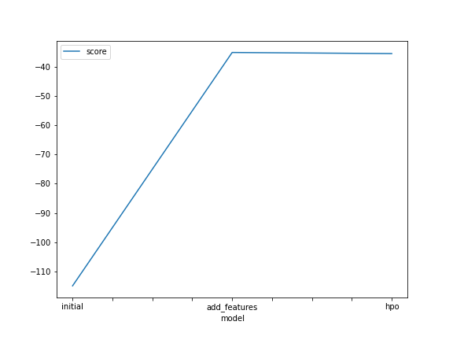
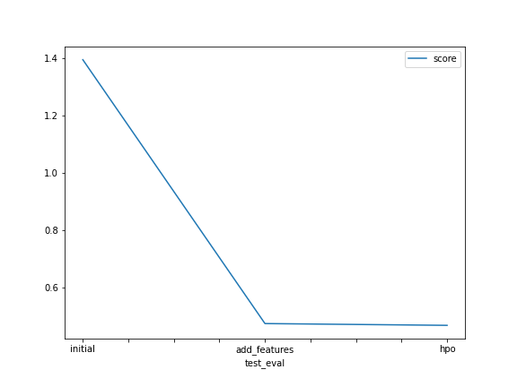

# Report: Predict Bike Sharing Demand with AutoGluon Solution
#### PRAFULL PARMAR

## Initial Training
### What did you realize when you tried to submit your predictions? What changes were needed to the output of the predictor to submit your results?

This was a typical Regression problem , where we were expected to predict the count of bikes demand based on a number of input features data. 
So the expected outcome from the model was to accurately predict the count of bike demand. 
However, before trying to submit the initial trained model's predictions on the test data, I noticed that some of the predicted output values were negative. Given the count of demand of bikes cannot be negative, I had to manually change all negative output values to 0 and then submit the results to Kaggle.

### What was the top ranked model that performed?
The top ranked model in my case was **"WeightedEnsemble_L3"**. In the Weighted Ensemble, the model combines the predictions from multiple models, where the contribution of each model is weighted proportionally to its skill or capability.

## Exploratory data analysis and feature creation
### What did the exploratory analysis find and how did you add additional features?

In the **exploratory data analysis (EDA)**, we noticed that we had a **date** column. So it might be more useful if we could split up the date column by adding in **more features** such as - **year, month, day, hour**.
So we added in these as new features in our train and test dataset. We also noticed the **season** and **weather** columns should actually be treated as category, so we updated the data type of these columns to **"category"**

### How much better did your model preform after adding additional features and why do you think that is?

After adding **additional features** the score was **0.47008** which was much better as compared to the **Initial Kaggle score** of the model, which was **1.38879**.
Adding additional features like **year, month, day, hour** columns and changing the data type of the **season** and **weather** columns to **category**, helped the model to better predict the bike demand.

## Hyper parameter tuning
### How much better did your model preform after trying different hyper parameters?

Post trying out different hyperparameter options available, I noticed that the score improved from **0.47008** to **0.46601**. Couple of hyperparameters that I tuned, included the training time limit, number of bag folds , number of stack levels.
Though, I could only improve the score slightly, as I believe this was due to the fact that the complete dataset is considered during the evaluation because of the increased number of folds and not just a isolated one part of the test dataset. 

### If you were given more time with this dataset, where do you think you would spend more time?

If I was given more time, then would spend time to fine tune the best performing models in AutoGluon by passing in specific hyperparameters for each of the best performing models. 
Further more would increase the train time limit, so that AutoGluon has more time for training more different types of other models.

### Create a table with the models you ran, the hyperparameters modified, and the kaggle score.
|model|time_limit|num_bags_folds|num_stack_levels|score|
|--|--|--|--|--|
|initial|600|0|0|1.38879|
|add_features|600|0|0|0.47008|
|hpo|700|5|3|0.46601|

### Create a line plot showing the top model score for the three (or more) training runs during the project.

### Create a line plot showing the top kaggle score for the three (or more) prediction submissions during the project.

## Summary

In this project we worked on the **"Bike Sharing Demand"** dataset's Kaggle competition. 
Problem statement involved accurately predicting the bike demands. 
We realized that this was a Regression problem and leveraged AutoGluon to create and train an initial model and achieved a Kaggle score of 1.38879 .
We performed some **exploratory data analysis (EDA)** and using concepts of feature engineering, we added in some new feature columns for year, month, day and hour. 
We also modified data types of categorical columns like season and weather. Post the feature engineering step, we trained our model again and we were able to achieve a Kaggle score of **0.47008**. We also worked on fine tuning some hyperparameters and were able to increase the score further to **0.46601**.
Thus, we were able to successfully apply concepts of EDA and hyperparameter tuning to our model to help improve its overall performance.   
